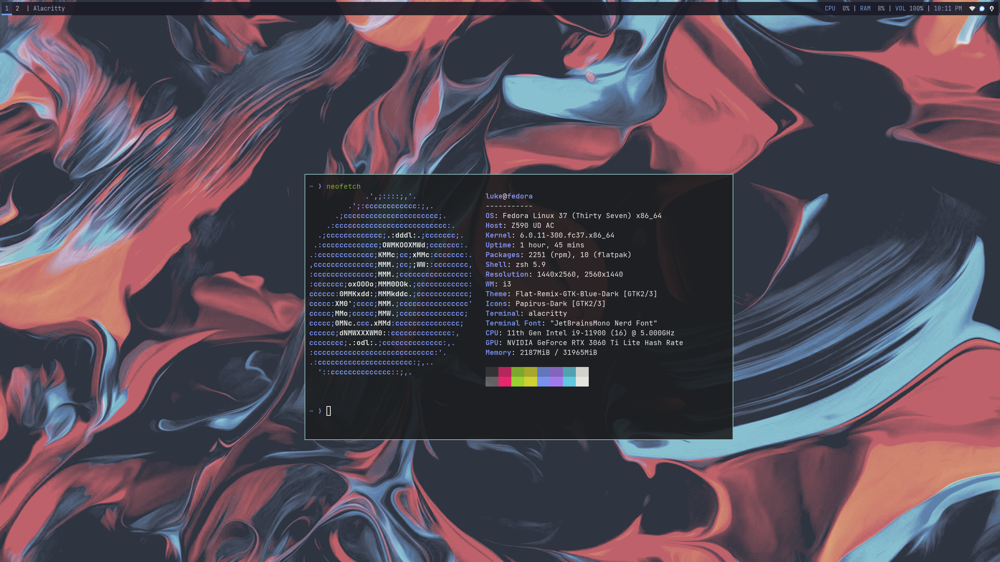

# My Fedora dotfiles

Hopefully this repo will help make regularly nuking my system just that little bit easier.

Feel free to copy anything you find here. I can guarantee it originally came from someone else.

i3wm on Fedora 37.
